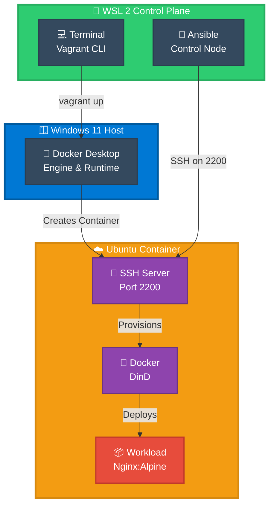

# 🚀 OPERATIONAL RUNBOOK: Immutable Infrastructure Deployment

> **Production-Grade SOP for Zero-Friction Infrastructure as Code**  
> Complete deployment, validation, and recovery procedures for Vagrant + Ansible + Docker

---

## ⚡ TL;DR — 30 Second Start

```bash
# 1. Setup WSL-Docker bridge
export VAGRANT_WSL_ENABLE_WINDOWS_ACCESS="1"
export PATH="$PATH:/mnt/c/Windows/System32"

# 2. Deploy infrastructure
vagrant up --provider=docker

# 3. Configure with Ansible
ANSIBLE_HOST_KEY_CHECKING=False ansible-playbook \
  -i "127.0.0.1:2200," playbook.yml -u root \
  -e "ansible_password=root" \
  --ssh-extra-args="-o StrictHostKeyChecking=no"

# Done! 🎉
```

---

## 📋 Quick Navigation

| Section | Purpose |
|---------|---------|
| [Prerequisites](#-prerequisites) | Verify your system is ready |
| [Deployment Pipeline](#-deployment-pipeline) | 5-phase workflow |
| [Troubleshooting](#-quick-troubleshooting) | Common issues & fixes |
| [Recovery](#-disaster-recovery) | When things break |
| [Checklists](#-operational-checklists) | Step-by-step verification |

---

## 🏛️ System Architecture & Data Flow



---

## ✅ Prerequisites

**Verify before starting:**

```bash
# Quick sanity check
wsl --version              # ✅ 2.0.0+
docker --version           # ✅ 24.0+
vagrant --version          # ✅ 2.4.0+
ansible --version          # ✅ 9.0+
docker ps                  # ✅ Should work
```

| Component | Min Version | Missing? |
|-----------|-------------|----------|
| **Windows** | 10 22H2 or 11 | [Get Windows](https://www.microsoft.com/en-us/windows) |
| **WSL 2** | 2.0.0+ | `wsl --install` |
| **Docker Desktop** | 24.0+ | [Download](https://www.docker.com/products/docker-desktop/) |
| **Vagrant** | 2.4.0+ | [Download](https://www.vagrantup.com/downloads) |
| **Ansible** | 9.0+ | `pip install ansible` |

---

## 🚀 DEPLOYMENT PIPELINE

### Phase 1️⃣: System Reset (Optional but Recommended)

> **Goal:** Achieve clean slate state for reproducible deployment

```bash
# ⚠️  WARNING: This removes ALL Docker containers & images

#!/bin/bash
set -e
echo "🧹 Full system reset in progress..."

# Remove containers & images
docker rm -f $(docker ps -aq) 2>/dev/null || true
docker rmi $(docker images -q) -f 2>/dev/null || true
docker system prune -a -f 2>/dev/null || true

# Clean Vagrant
vagrant destroy -f 2>/dev/null || true
rm -rf .vagrant/

# Remove SSH fingerprints
ssh-keygen -f ~/.ssh/known_hosts -R "[127.0.0.1]:2200" 2>/dev/null || true

echo "✅ Clean slate ready!"
```

**Skip this if:** You want to keep existing Docker images (faster).

---

### Phase 2️⃣: WSL Configuration

> **Goal:** Enable WSL ↔ Docker Desktop communication

**Option A: One-Time Setup**
```bash
export VAGRANT_WSL_ENABLE_WINDOWS_ACCESS="1"
export PATH="$PATH:/mnt/c/Windows/System32"
docker ps  # Verify
```

**Option B: Permanent Setup** (Recommended)
```bash
cat >> ~/.bashrc <<'EOF'

# ===== Infrastructure Configuration =====
export VAGRANT_WSL_ENABLE_WINDOWS_ACCESS="1"
export PATH="$PATH:/mnt/c/Windows/System32"
export ANSIBLE_HOST_KEY_CHECKING=False
# ========================================
EOF

source ~/.bashrc
```

**Verify:**
```bash
docker ps  # Should connect to Docker Desktop
```

---

### Phase 3️⃣: Deploy Infrastructure

> **Goal:** Spin up Ubuntu container with SSH access

```bash
# Clone repository
git clone https://github.com/jgaragorry/iac-immutable-deployment-vagrant-ansible.git
cd iac-immutable-deployment-vagrant-ansible

# Launch container
vagrant up --provider=docker
```

**What happens** (40-60 seconds):
- ✅ Vagrant creates Ubuntu 22.04 container
- ✅ SSH server installed on port 2200
- ✅ Network bridges configured
- ✅ Container marked as "running"

**Verify:**
```bash
vagrant status                     # Should show "running"
vagrant ssh                        # Should connect without password
docker ps                          # Should show 1 container
```

---

### Phase 4️⃣: Configure with Ansible

> **Goal:** Apply configuration, install services, deploy workloads

```bash
# THE "GOLDEN COMMAND"
ANSIBLE_HOST_KEY_CHECKING=False ansible-playbook \
  -i "127.0.0.1:2200," \
  playbook.yml \
  -u root \
  -e "ansible_password=root" \
  --ssh-extra-args="-o StrictHostKeyChecking=no"
```

**Expected execution** (60-120 seconds):
- ✅ System packages updated
- ✅ Docker daemon installed & started
- ✅ Application containers deployed
- ✅ Health checks passed
- ✅ Output: `changed=X ok=Y failed=0`

**Run a second time** (idempotency check):
```bash
# Should see "changed=0" at the end
ansible-playbook -i "127.0.0.1:2200," playbook.yml -u root \
  -e "ansible_password=root" --ssh-extra-args="-o StrictHostKeyChecking=no"
```

---

### Phase 5️⃣: Validation

> **Goal:** Confirm everything works end-to-end

```bash
# 1. SSH connectivity
vagrant ssh -c "whoami"            # Should show: root

# 2. Docker check
vagrant ssh -c "docker ps"         # Should show running containers

# 3. Application health
curl -I http://localhost:80        # Should return HTTP 200

# 4. Run smoke tests
bash scripts/smoke-test.sh         # Should pass all checks

# 5. Full system health
vagrant ssh -c "systemctl status docker"  # Should show: active (running)
```

✅ **All green?** Deployment complete!

---

## 🔍 QUICK TROUBLESHOOTING

### ❌ `docker: command not found`

```bash
# Fix 1: Start Docker Desktop on Windows
#   → Windows Start Menu → Search "Docker" → Launch

# Fix 2: Add Docker to PATH
export PATH="$PATH:/mnt/c/Windows/System32"
docker ps
```

### ❌ `Unable to connect to Docker daemon`

```bash
# Enable WSL interoperability
export VAGRANT_WSL_ENABLE_WINDOWS_ACCESS="1"
vagrant up --provider=docker
```

### ❌ `SSH: Connection refused [127.0.0.1:2200]`

```bash
# Check container status
vagrant status

# If not running:
vagrant up --provider=docker

# Clear stale SSH keys
ssh-keygen -f ~/.ssh/known_hosts -R "[127.0.0.1]:2200"

# Manual SSH test
ssh -vvv -p 2200 root@127.0.0.1
```

### ❌ `Ansible UNREACHABLE`

```bash
# Wait for SSH to stabilize
sleep 10

# Test SSH manually first
ssh -p 2200 root@127.0.0.1

# Then retry Ansible
ansible-playbook -i "127.0.0.1:2200," playbook.yml -u root -e "ansible_password=root"
```

### ❌ `Module docker_container not found`

```bash
# Install community collections
ansible-galaxy collection install community.docker

# Verify Ansible version
ansible --version  # Should be 9.0+
```

### ❌ `Docker image pull timeout`

```bash
# Test internet from container
vagrant ssh -c "curl https://www.google.com"

# Manual image pull
vagrant ssh -c "docker pull nginx:alpine"

# If behind proxy, edit Docker config
vagrant ssh
sudo vi /etc/docker/daemon.json
# Add proxy settings, restart Docker
```

---

## 🆘 DISASTER RECOVERY

### Complete System Reset

> Use when nothing works and you need a clean start

```bash
#!/bin/bash

echo "🔄 Complete system recovery..."

# 1. Nuclear option
vagrant destroy -f 2>/dev/null || true
rm -rf .vagrant 2>/dev/null || true
docker rm -f $(docker ps -aq) 2>/dev/null || true
docker rmi $(docker images -q) -f 2>/dev/null || true
docker system prune -a -f 2>/dev/null || true

# 2. Clear SSH
ssh-keygen -f ~/.ssh/known_hosts -R "[127.0.0.1]:2200" 2>/dev/null || true

# 3. Restart Docker (Windows)
# Close Docker Desktop, wait 10 seconds, reopen

# 4. Redeploy
sleep 10
vagrant up --provider=docker
ansible-playbook -i "127.0.0.1:2200," playbook.yml -u root -e "ansible_password=root"

echo "✅ Recovery complete!"
```

### Partial Recovery (Keep Images)

```bash
# Faster if you don't want to re-download images
vagrant destroy -f
rm -rf .vagrant/
vagrant up --provider=docker
# Re-run Ansible
```

### Network Troubleshooting

```bash
# Docker networking broken?
docker network prune -f
vagrant destroy -f
docker system prune -a -f
# Restart Docker Desktop from Windows
vagrant up --provider=docker
```

---

## 📊 OPERATIONAL CHECKLISTS

### ✓ Pre-Deployment Checklist

- [ ] Windows Version: 10/11 (22H2+)
- [ ] WSL 2 installed and running (`wsl --version`)
- [ ] Docker Desktop running (check system tray)
- [ ] Vagrant installed (`vagrant --version`)
- [ ] Ansible installed (`ansible --version`)
- [ ] SSH client available (`ssh -V`)
- [ ] Repository cloned
- [ ] Network connectivity to Docker Hub confirmed

### ✓ Post-Deployment Checklist

- [ ] `vagrant status` → "running"
- [ ] `docker ps` → shows 1 container
- [ ] `vagrant ssh` → connects without prompt
- [ ] Ansible playbook completed with `failed=0`
- [ ] `curl http://localhost:80` → HTTP 200
- [ ] `vagrant ssh -c "docker ps"` → shows services
- [ ] `bash scripts/smoke-test.sh` → all passed

### ✓ Recovery Verification

- [ ] `.vagrant/` directory cleaned
- [ ] All Docker resources removed
- [ ] SSH known_hosts cleared
- [ ] Docker Desktop restarted
- [ ] Fresh deployment successful
- [ ] All services responding
- [ ] No errors in logs

---

## 🆙 IDEMPOTENCE VERIFICATION

Run this to ensure your Ansible playbook is truly idempotent:

```bash
#!/bin/bash

echo "Testing idempotence..."

# Run 1
RESULT1=$(ansible-playbook -i "127.0.0.1:2200," playbook.yml \
  -u root -e "ansible_password=root" 2>&1 | grep "changed=")

echo "Run 1: $RESULT1"

# Run 2 (should show changed=0)
RESULT2=$(ansible-playbook -i "127.0.0.1:2200," playbook.yml \
  -u root -e "ansible_password=root" 2>&1 | grep "changed=")

echo "Run 2: $RESULT2"

# Verify
if echo "$RESULT2" | grep -q "changed=0"; then
  echo "✅ Playbook is idempotent!"
else
  echo "⚠️  Non-idempotent tasks detected"
fi
```

---

## 📞 SUPPORT & DEBUGGING

### Enable Verbose Output

```bash
# Show task details
ansible-playbook -i "127.0.0.1:2200," playbook.yml -u root -e "ansible_password=root" -v

# Show module details
ansible-playbook -i "127.0.0.1:2200," playbook.yml -u root -e "ansible_password=root" -vv

# Full debug output
ansible-playbook -i "127.0.0.1:2200," playbook.yml -u root -e "ansible_password=root" -vvv
```

### Check Logs

```bash
# System logs inside container
vagrant ssh -c "journalctl -n 50 -xe"

# Docker daemon logs
vagrant ssh -c "journalctl -u docker -n 50"

# Application logs
vagrant ssh -c "docker logs web_app | tail -50"
```

### Manual Service Checks

```bash
# SSH into container
vagrant ssh

# Inside container:
systemctl status docker          # Docker service status
docker ps                        # Running containers
docker images                    # Downloaded images
docker network ls                # Network configuration
df -h                           # Disk space
free -h                         # Memory usage
curl http://localhost:80        # Test application

# Exit
exit
```

### Contact

- **GitHub Issues:** [iac-immutable-deployment](https://github.com/jgaragorry/iac-immutable-deployment-vagrant-ansible/issues)
- **LinkedIn:** [jgaragorry](https://www.linkedin.com/in/jgaragorry)
- **WhatsApp:** [+56 956744034](https://wa.me/56956744034)

---

## 🧠 UNDERSTANDING THE ARCHITECTURE

### Why This Design?


**Key Decisions:**

| Decision | Why |
|----------|-----|
| **WSL 2 + Docker Desktop** | Native Windows integration, zero VM overhead |
| **Vagrant Docker Provider** | Faster than VirtualBox, container-native |
| **Ansible** | Idempotent config, zero manual steps, reproducible |
| **Port 2200** | Avoids conflicts with host SSH services |
| **Password Auth** | Simple for local dev (use SSH keys in production) |
| **DinD** | Application isolation, production-like environment |

---

## 🎯 WHAT "IMMUTABLE" MEANS

✅ **Every deployment is identical**
- Same commands → Same result
- No "configuration drift"
- Environment is reproducible from scratch

✅ **Destruction is free**
- No fear of losing manual configuration
- Can redeploy at will
- Perfect for testing & disaster recovery drills

✅ **Version control is source of truth**
- All infrastructure in Git
- Peer review before deployment
- Complete audit trail

✅ **Idempotent operations**
- Run 10 times, get same result
- Safe to retry after failures
- No side effects

---

## 📖 REFERENCE MATERIAL

| Topic | Link |
|-------|------|
| **Vagrant Docs** | https://www.vagrantup.com/docs |
| **Ansible Best Practices** | https://docs.ansible.com/ansible/latest/playbook_guide/ |
| **Docker DinD** | https://www.docker.com/blog/docker-in-docker/ |
| **WSL 2 Guide** | https://learn.microsoft.com/en-us/windows/wsl/ |
| **SRE Handbook** | https://sre.google/books/ |

---

## 📝 DOCUMENT METADATA

**Jose Garagory** — SRE & Infrastructure Architect

| Platform | Link |
|----------|------|
| **LinkedIn** | [jgaragorry](https://www.linkedin.com/in/jgaragorry) |
| **GitHub** | [jgaragorry](https://github.com/jgaragorry/) |
| **WhatsApp** | [+56 956744034](https://wa.me/56956744034) |
| **Website** | [geekmonkeytech.com](https://geekmonkeytech.com/) |

---

<div style="text-align: center; padding: 20px; border-top: 3px solid #E74C3C; border-bottom: 3px solid #E74C3C; background: #f8f9fa; margin-top: 40px;">

### 🚀 Ready to Deploy?

**Quick Summary:** Clean state → Setup WSL → Deploy with Vagrant → Configure with Ansible → Validate

**Estimated Time:** 5-10 minutes total

**Questions?** Check [Troubleshooting](#-quick-troubleshooting) or [Contact](#contact)

</div>

---

**This runbook is intentionally dense for quick reference and thorough for complete understanding.**


